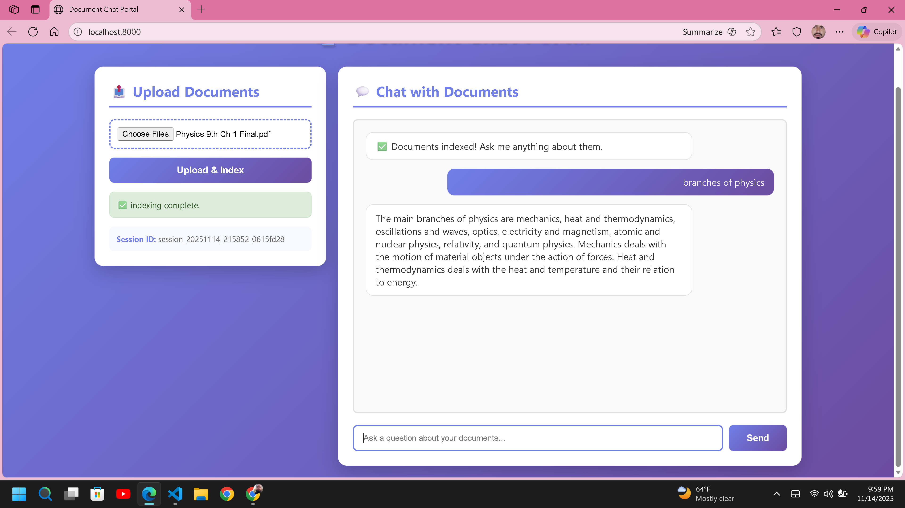

# LLMOps Series - RAG Implementation

A comprehensive project demonstrating Retrieval-Augmented Generation (RAG) implementation using LangChain, Google Gemini, and FAISS vector database with a fully functional web interface.

## 🖼️ Application Preview



*Interactive web interface for uploading documents and chatting with your data using RAG*

## 📋 Overview

This project is part of the LLMOps series, focusing on building a practical RAG (Retrieval-Augmented Generation) system. It demonstrates how to process PDF documents, create embeddings, store them in a vector database, and use them for intelligent question-answering.

## 🚀 Features

- **Web Application**: FastAPI-based web interface for document upload and chat
- **PDF Document Processing**: Load and parse PDF, TXT, and DOCX files
- **Text Chunking**: Intelligent text splitting with RecursiveCharacterTextSplitter
- **Vector Embeddings**: Generate embeddings using Google Generative AI
- **Vector Storage**: Store and retrieve embeddings using FAISS vector database
- **Conversational RAG**: Context-aware question answering with chat history
- **Session Management**: Multi-user support with session-based document isolation
- **LangSmith Integration**: Tracing and evaluation for LLM applications
- **Interactive Notebook**: Jupyter notebook for experimentation and evaluation

## 📁 Project Structure

```
llmops-series/
├── data/                          # Directory for PDF documents
│   └── Physics 9th Ch 1 Final.pdf
├── notebook/                      # Jupyter notebooks
│   └── rag.ipynb                 # Main RAG implementation notebook
├── main.py                       # Main application entry point
├── pyproject.toml                # Project dependencies and metadata
├── .env                          # Environment variables (not in repo)
├── .gitignore                    # Git ignore rules
└── README.md                     # This file
```

## 🛠️ Tech Stack

- **Python**: 3.12+
- **FastAPI**: Modern web framework for building APIs
- **LangChain**: Framework for LLM applications
- **Google Gemini**: Language model for generation (Gemini 2.0 Flash)
- **Google Generative AI**: Text embeddings (text-embedding-004)
- **FAISS**: Facebook AI Similarity Search for vector storage
- **PyPDF/Docx2txt**: Document processing
- **LangSmith**: LLM tracing and evaluation
- **python-dotenv**: Environment variable management
- **UV**: Fast Python package installer

## 📦 Dependencies

Core dependencies include:
- `fastapi` >= 0.121.1
- `uvicorn` - ASGI server
- `langchain-community` >= 0.3.27
- `langchain-google-genai` >= 2.1.0
- `langchain-openai`
- `pypdf` >= 6.1.3
- `docx2txt` >= 0.8
- `faiss-cpu` >= 1.12.0
- `structlog` >= 24.1.0
- `python-dotenv` >= 1.0.1
- `ipykernel` >= 7.0.1

## 🔧 Installation

1. **Clone the repository**
   ```bash
   git clone https://github.com/ikram2500/llmops-series.git
   cd llmops-series
   ```

2. **Set up environment variables**
   
   Create a `.env` file in the root directory:
   ```env
   OPENAI_API_KEY=your_openai_api_key_here
   GOOGLE_API_KEY=your_google_api_key_here
   GROQ_API_KEY=your_groq_api_key_here
   LLM_PROVIDER=google
   
   # LangSmith Configuration (Optional)
   LANGCHAIN_TRACING_V2=true
   LANGCHAIN_ENDPOINT=https://api.smith.langchain.com
   LANGCHAIN_API_KEY=your_langsmith_api_key
   LANGCHAIN_PROJECT=llmops-series
   ```

3. **Install dependencies**
   
   Using UV (recommended):
   ```bash
   uv pip install -e .
   ```
   
   Or using pip:
   ```bash
   pip install -e .
   ```

## 📖 Usage

### Running the Web Application

1. **Start the server**:
   ```bash
   python main.py
   ```
   
   The server will start at `http://localhost:8000`

2. **Upload documents**:
   - Open your browser and navigate to `http://localhost:8000`
   - Click "Choose Files" and select PDF, TXT, or DOCX files
   - Click "Upload & Index" to process the documents
   - Wait for the indexing to complete

3. **Chat with your documents**:
   - Once indexing is complete, you'll receive a session ID
   - Type your question in the chat input
   - The RAG system will retrieve relevant context and generate answers

### Running the Jupyter Notebook

1. Navigate to the notebook directory:
   ```bash
   cd notebook
   ```

2. Open the notebook:
   ```bash
   jupyter notebook rag.ipynb
   ```

3. For evaluation:
   ```bash
   jupyter notebook evaluations.ipynb
   ```

### Key Components

#### 1. Data Ingestion
```python
from langchain_community.document_loaders import PyPDFLoader

loader = PyPDFLoader('path/to/your/document.pdf')
documents = loader.load()
```

#### 2. Text Splitting
```python
from langchain_text_splitters import RecursiveCharacterTextSplitter

text_splitter = RecursiveCharacterTextSplitter(
    chunk_size=1000,
    chunk_overlap=100,
    length_function=len
)
text_chunks = text_splitter.split_documents(documents)
```

#### 3. Embeddings & Vector Store
```python
from langchain_openai.embeddings import OpenAIEmbeddings
from langchain_community.vectorstores import FAISS

embeddings = OpenAIEmbeddings()
vectorstore = FAISS.from_documents(text_chunks, embeddings)
```

## 🎯 Use Cases

- Educational content Q&A system
- Document search and retrieval
- Knowledge base creation
- Semantic search implementation
- RAG system prototyping

## 🔐 Environment Variables

Required environment variables:
- `GOOGLE_API_KEY`: Your Google AI API key for embeddings and LLM
- `LLM_PROVIDER`: Set to "google", "openai", or "groq"
- `OPENAI_API_KEY`: (Optional) If using OpenAI models
- `GROQ_API_KEY`: (Optional) If using Groq models

Optional LangSmith variables for tracing:
- `LANGCHAIN_TRACING_V2`: Enable tracing (true/false)
- `LANGCHAIN_ENDPOINT`: LangSmith API endpoint
- `LANGCHAIN_API_KEY`: Your LangSmith API key
- `LANGCHAIN_PROJECT`: Project name for organizing traces

## 📝 Notes

- The project currently uses a Physics textbook (9th grade, Chapter 1) as sample data
- Chunk size and overlap can be adjusted based on your specific use case
- FAISS provides efficient similarity search for the vector embeddings

## 🤝 Contributing

Contributions are welcome! Please feel free to submit a Pull Request.

## 📄 License

This project is open source and available under the MIT License.

## 👤 Author

**Ikram**
- GitHub: [@ikram2500](https://github.com/ikram2500)

## 🙏 Acknowledgments

- LangChain for the amazing framework
- OpenAI for embeddings and LLM capabilities
- Facebook AI for FAISS vector database

---

**AWS IAM user policies**: 
1. AmazonEC2ContainerRegistryFullAccess 
2. AmazonECS_FullAccess 
3. AmazonS3FullAccess 
4. CloudWatchFullAccess 
5. SecretsManagerReadWrite
6. AllowECSLogs '''{
	"Version": "2012-10-17",
	"Statement": [
		{
			"Sid": "Statement1",
			"Effect": "Allow",
			"Action": [
			    "logs:CreateLogGroup",
			    "logs:CreateLogStream",
			    "logs:PutLogEvents"
			    ],
			"Resource": "*"
		}
	]
}'''
7. AllowSecretsAccess  '''{
	"Version": "2012-10-17",
	"Statement": [
		{
			"Sid": "Statement1",
			"Effect": "Allow",
			"Action": "secretsmanager:GetSecretValue",
			"Resource": "arn:aws:secretsmanager:ap-southeast-2:459497895986:secret:api_keys-nZTtj8"
		}
	]
}''' 
**Note**: This is part of an educational series on LLM Operations (LLMOps). Stay tuned for more projects!
